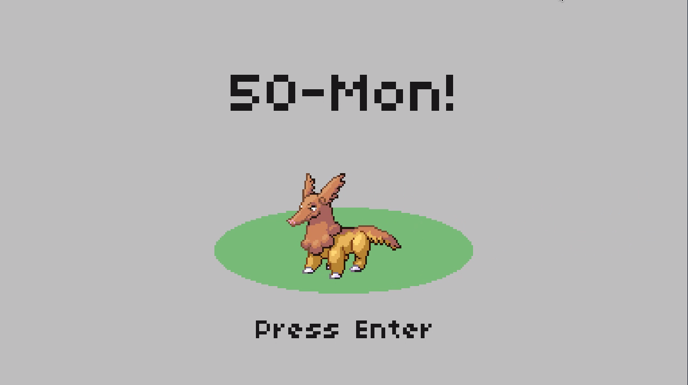

# 50-Mon

Project 7 of [CS50's Introduction to Games Development](https://cs50.harvard.edu/games/2018/)

*50-Mon* is a game heavily inspired by [Pokémon Red & Blue](https://en.wikipedia.org/wiki/Pok%C3%A9mon_Red_and_Blue) (1996) and built using the [LÖVE2D](https://love2d.org/) framework. The goal for this assessment was to implement a level-up system.

[Full project specification](https://cs50.harvard.edu/games/2018/projects/7/pokemon/).

## Setup
First, clone this repository:
```bash
git clone https://github.com/calumbell/cs50g-50-mon
```
Install **LÖVE2D** (v10.2) - [click here for installation instructions](https://love2d.org/wiki/Getting_Started)

To run the game:
```bash
cd cs50g-50-mon
love .
```

## Visuals
You can see a video demonstration of this project [here](https://youtu.be/HhQm5arN4Jc).




## Requirements
*50-Mon* was built using the [LÖVE2D](https://love2d.org/) framework (version 10.2).

[Push](https://github.com/Ulydev/push) was used for resolution-handling, [hump](https://github.com/vrld/hump/blob/master/class.lua) was used for Lua object-orientation, and [Knife](https://github.com/airstruck/knife) was used to handle asynchronous code, chained functions, tweening, etc.